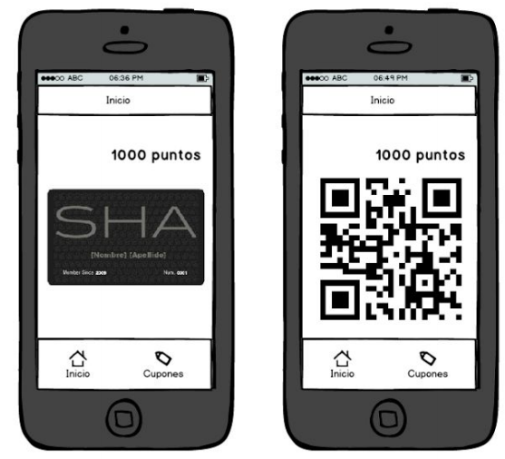

#Obligatorio 1 - Electiva IOS

Integrantes:
	
- Santiago Berrueta
- Rodrigo Suarez
	
##Descripción general

Esta propuesta responde a la necesidad de una cadena de supermados de contar con una aplicación móvil para su tarjeta de puntos. Esta app permite gestionar todo lo referente a planes de afinidad (loyalty).

##Requerimientos

Los requerimientos que de la aplicación son:

- **Login**: El usuario se autentica en la aplicación
- **Desplegar QR de tarjeta de fidelidad**: Se desplegará el código QR para identificar el
socio
- **Mostrar puntos**: Se le mostrará al usuario los puntos que tiene acumulado hasta el
momento
- **Listar cupones**: Se le listarán todos los cupones que el usuario tiene disponible
- **Mostrar cupón (con código QR)**: Se desplegará la información correspondiente a un
cupón seleccionado, junto a un código QR para identificar el cupón

##Casos de uso

A continuación se detalla la interacción del usuario con la aplicación móvil (de ahora en más "App")

###Login

1. Usuario ingresa e­mail y password.
2. App valida que usuario sea `ucu@ucu.com` y password `ucu2016`
	- **a Valida ok**
		- App sigue a la pantalla de inicio
	- **b No valida ok**
		- Mensaje que los datos no son correctos y que lo intente nuevamente
		
		
	
---

###Inicio

1.  En la pantalla Inicio el usuario hace click en la tarjeta.
2. Se genera y despliega el código QR de la tarjeta en base al email.

---

###Mostrar puntos

1. En la pantalla Inicio se le indicará cuántos puntos tiene acumulados.
2. Hacer un refresh cada cierto tiempo.

---

###Listar Cupones

1. Usuario accede a los cupones a través del Tab de Cupones.
2. Se listan los cupones que un usuario tiene disponibles.

---

###Mostar cupón (con código QR)

1. Usuario hace click en cupón.
2. Se muestra cupón con código QR en base al id del cupón. 

